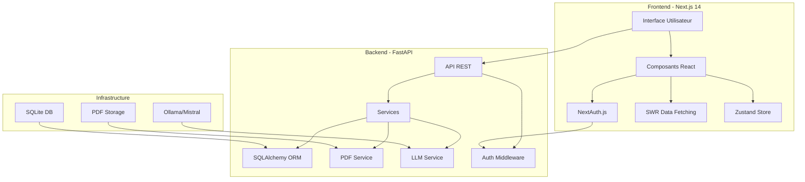

# 🎓 Koutoubi AI - Plateforme Éducative Intelligente

<div align="center">
  
  
  
  
  
  
</div>

<div align="center">
  <h3>📚 Révolutionnez l'apprentissage avec l'Intelligence Artificielle</h3>
  <p>Une plateforme éducative moderne pour les élèves mauritaniens, intégrant les manuels scolaires officiels avec des outils d'IA avancés.</p>
</div>

---

## 📋 Table des Matières

- [🌟 Fonctionnalités](#-fonctionnalités)
- [🏗️ Architecture](#️-architecture)
- [🚀 Installation Rapide](#-installation-rapide)
- [📖 Guide d'Installation Détaillé](#-guide-dinstallation-détaillé)
- [💻 Utilisation](#-utilisation)
- [🔒 Sécurité](#-sécurité)
- [🔧 Configuration](#-configuration)
- [📁 Structure du Projet](#-structure-du-projet)
- [🤖 Intégration IA](#-intégration-ia)
- [📚 API Documentation](#-api-documentation)
- [🧪 Tests](#-tests)
- [🤝 Contribution](#-contribution)
- [📄 Licence](#-licence)

## 🌟 Fonctionnalités

### 📚 Gestion de Contenu

- **Manuels Scolaires Numériques** : Accès à tous les manuels du programme mauritanien (64 manuels)
- **Navigation PDF** : Lecture page par page avec extraction de texte intelligente
- **Support Multilingue** : Français et Arabe
- **Favoris** : Marquez vos cours préférés pour un accès rapide

### 🤖 Intelligence Artificielle

- **Résumés Automatiques** : Génération de résumés concis pour chaque page
- **Quiz Personnalisés** : Création automatique de QCM adaptés au niveau
- **Flashcards** : Cartes de révision générées par IA
- **Cartes Mentales** : Visualisation des concepts clés
- **Explications IA** : Clarifications instantanées sur n'importe quel concept
- **Assistant Q&A** : Réponses contextuelles aux questions des élèves

### 👨‍🎓 Expérience Utilisateur

- **Interface Moderne** : Design responsive avec Next.js 14 et Tailwind CSS
- **Authentification Sécurisée** : NextAuth.js avec JWT
- **Rôles Multiples** : Support pour étudiants, enseignants, parents et administrateurs
- **Suivi de Progression** : Statistiques détaillées d'apprentissage
- **Mode Éducateur** : Interface spéciale pour les enseignants et parents

### 🔒 Sécurité & Administration

- **Authentification Robuste** : Standard de l'industrie avec NextAuth.js
- **Protection des Endpoints** : Tous les endpoints API sont sécurisés
- **Gestion des Rôles** : Permissions granulaires selon le type d'utilisateur
- **Panel Admin** : Interface complète de gestion des utilisateurs et contenus

## 🏗️ Architecture



### Stack Technique

#### Backend

- **Framework** : FastAPI (Python 3.12+)
- **Base de données** : SQLite avec SQLAlchemy ORM
- **Authentification** : JWT avec middleware sécurisé
- **PDF Processing** : PyMuPDF, PyPDF2
- **IA/LLM** : Ollama avec Mistral 7B
- **Sécurité** : Bcrypt pour le hashing des mots de passe

#### Frontend

- **Framework** : Next.js 14 avec App Router
- **UI Library** : React 18.3 + TypeScript
- **Authentification** : NextAuth.js (Industry Standard)
- **Styling** : Tailwind CSS + shadcn/ui
- **State Management** : Zustand
- **Data Fetching** : SWR + API Client custom
- **Animations** : Framer Motion

## 🚀 Installation Rapide

```bash
# Cloner le repository
git clone https://github.com/GitHub-Khbabah/koutoubi-ai2.git
cd koutoubi-ai2

# Lancer l'installation automatique
./start-koutoubi.sh
```

Le script va automatiquement :

- ✅ Vérifier les prérequis
- ✅ Installer les dépendances
- ✅ Configurer Ollama
- ✅ Initialiser la base de données
- ✅ Démarrer tous les services
- ✅ Ouvrir l'application dans le navigateur

## 📖 Guide d'Installation Détaillé

### Prérequis

- **Python** 3.12 ou supérieur
- **Node.js** 18.17.0 ou supérieur
- **Ollama** (pour l'IA locale)
- **Git**
- 8 GB RAM minimum (16 GB recommandé)
- 5 GB d'espace disque libre

### 1. Installation d'Ollama

#### macOS

```bash
brew install ollama
ollama pull mistral:7b-instruct
```

#### Linux

```bash
curl -fsSL https://ollama.ai/install.sh | sh
ollama pull mistral:7b-instruct
```

#### Windows

Téléchargez depuis [ollama.ai](https://ollama.ai) puis :

```bash
ollama pull mistral:7b-instruct
```

### 2. Configuration Backend

```bash
cd koutoubi-backend

# Créer l'environnement virtuel
python3 -m venv venv

# Activer l'environnement
source venv/bin/activate  # Linux/macOS
# ou
venv\Scripts\activate     # Windows

# Installer les dépendances
pip install -r requirements.txt

# Configurer les variables d'environnement
cp .env.example .env
# Éditer .env avec vos paramètres

# Initialiser la base de données
python scripts/init_db.py

# Créer les comptes de test
python scripts/manage_users.py reset-test
```

### 3. Configuration Frontend

```bash
cd koutoubi-frontend

# Installer les dépendances
npm install

# Configurer l'environnement
cp .env.example .env.local
# Éditer .env.local si nécessaire
```

### 4. Démarrage des Services

#### Option 1 : Script Automatique

```bash
./start-koutoubi.sh
```

#### Option 2 : Démarrage Manuel

**Terminal 1 - Ollama :**

```bash
ollama serve
```

**Terminal 2 - Backend :**

```bash
cd koutoubi-backend
source venv/bin/activate
python -m uvicorn app.main:app --reload --host 0.0.0.0 --port 8000
```

**Terminal 3 - Frontend :**

```bash
cd koutoubi-frontend
npm run dev
```

## 💻 Utilisation

### Accès à l'Application

1. Ouvrez votre navigateur : <http://localhost:3000>
2. Connectez-vous avec un compte de test
3. Explorez les cours disponibles

### Comptes de Test

| Rôle | Email | Mot de passe | Accès |
|------|-------|--------------|-------|
| **Admin** | admin@koutoubi.ai | Admin123! | Panel admin complet |
| **Enseignant** | teacher@koutoubi.ai | Teacher123! | Mode éducateur |
| **Étudiant** | student@koutoubi.ai | Student123! | Interface standard |
| **Parent** | parent@koutoubi.ai | Parent123! | Mode parent |

### Fonctionnalités Principales

#### 📖 Lecture de Manuels

1. Connectez-vous avec un compte
2. Sélectionnez votre niveau (Secondaire 1 ou 2)
3. Choisissez l'année et la matière
4. Naviguez page par page avec les flèches
5. Utilisez les outils IA dans le panneau latéral

#### 🤖 Outils IA

- **Résumer** : Génère un résumé concis de la page
- **Quiz** : Crée 5 questions QCM sur le contenu
- **Flashcards** : Génère des cartes de révision
- **Carte Mentale** : Visualise les concepts clés
- **Expliquer** : Obtient des clarifications détaillées
- **Q&A** : Pose des questions spécifiques

#### 👨‍🏫 Mode Éducateur

Pour les enseignants et parents :
- Suivi de progression des élèves
- Création de groupes de classe
- Statistiques d'utilisation
- Gestion des contenus

## 🔒 Sécurité

### Authentification

- **NextAuth.js** : Standard de l'industrie pour l'authentification React
- **JWT Tokens** : Expiration configurable (par défaut 7 jours)
- **Bcrypt** : Hashing sécurisé des mots de passe
- **Protection CSRF** : Intégrée avec NextAuth

### API Security

- **Tous les endpoints sont protégés** par authentification
- **Rate Limiting** : Protection contre les abus
- **Validation des entrées** : Pydantic pour la validation côté serveur
- **CORS configuré** : Seules les origines autorisées

### Gestion des Utilisateurs

```bash
# Lister tous les utilisateurs
python scripts/manage_users.py list

# Réinitialiser un mot de passe
python scripts/manage_users.py reset-password user@email.com

# Créer un nouvel utilisateur
python scripts/manage_users.py create email@example.com teacher
```

## 🔧 Configuration

### Variables d'Environnement Backend (.env)

```env
# Base de données
DATABASE_URL=sqlite:///./koutoubi.db

# Sécurité
SECRET_KEY=your-secret-key-change-in-production
ALGORITHM=HS256
ACCESS_TOKEN_EXPIRE_MINUTES=10080

# Ollama Configuration
OLLAMA_BASE_URL=http://localhost:11434
LLM_MODEL=mistral:7b-instruct
LLM_TIMEOUT=30.0

# CORS
CORS_ORIGINS=["http://localhost:3000"]

# Rate Limiting
RATE_LIMIT_REQUESTS=100
RATE_LIMIT_WINDOW=60
```

### Variables d'Environnement Frontend (.env.local)

```env
# NextAuth Configuration
NEXTAUTH_URL=http://localhost:3000
NEXTAUTH_SECRET=your-nextauth-secret-change-in-production

# Backend API
NEXT_PUBLIC_API_URL=http://127.0.0.1:8000
NEXT_PUBLIC_API_VERSION=v1

# Application
NEXT_PUBLIC_APP_NAME=Koutoubi AI
```

## 📁 Structure du Projet

```
koutoubi-ai2/
├── 📂 koutoubi-backend/
│   ├── 📂 app/
│   │   ├── 📂 api/          # Endpoints REST (tous sécurisés)
│   │   ├── 📂 core/         # Configuration & sécurité
│   │   ├── 📂 models/       # Modèles SQLAlchemy
│   │   ├── 📂 schemas/      # Schémas Pydantic
│   │   ├── 📂 services/     # Logique métier
│   │   └── main.py          # Point d'entrée FastAPI
│   ├── 📂 scripts/          # Scripts de gestion
│   ├── requirements.txt
│   └── .env
│
├── 📂 koutoubi-frontend/
│   ├── 📂 src/
│   │   ├── 📂 app/          # Pages Next.js (App Router)
│   │   ├── 📂 components/   # Composants React
│   │   ├── 📂 lib/          # API client & auth
│   │   ├── 📂 hooks/        # Hooks personnalisés
│   │   └── 📂 store/        # État global (Zustand)
│   ├── 📂 public/           # Assets statiques
│   ├── package.json
│   └── .env.local
│
├── 📂 content/
│   └── 📂 pdf/              # 64 manuels scolaires
│       ├── 📂 secondaire1/  # 1ère, 2ème, 3ème année
│       └── 📂 secondaire2/  # 4ème, 5ème, 6ème, 7ème année
│
├── 📂 docs/                 # Documentation complète
├── 📂 scripts/              # Scripts de démarrage
└── README.md
```

## 🤖 Intégration IA

### Modèle Utilisé

- **Mistral 7B Instruct** : Optimisé pour le français et l'arabe
- **Hébergement** : Local via Ollama (pas de coûts cloud)
- **Performance** : ~2-5 secondes par requête
- **Rate Limiting** : Protection contre les abus

### Endpoints IA Disponibles

```python
# Générer un résumé
POST /api/v1/summary/generate
Authorization: Bearer <token>
{
  "pdf_path": "path/to/pdf",
  "page_number": 1
}

# Créer un quiz
POST /api/v1/quiz
Authorization: Bearer <token>
{
  "chapter_id": "chapter-id",
  "num_questions": 5
}

# Générer des flashcards
POST /api/v1/flashcards
Authorization: Bearer <token>
{
  "chapter_id": "chapter-id",
  "num_cards": 10
}

# Créer une carte mentale
POST /api/v1/mindmap/generate/{pdf_id}
Authorization: Bearer <token>
```

## 📚 API Documentation

### Documentation Interactive

- **Swagger UI** : <http://localhost:8000/docs>
- **ReDoc** : <http://localhost:8000/redoc>

### Endpoints Principaux

#### Authentification (Public)

- `POST /api/v1/auth/register` - Inscription
- `POST /api/v1/auth/token` - Connexion
- `GET /api/v1/auth/me` - Profil utilisateur (protégé)

#### Contenu (Protégé)

- `GET /api/v1/content/courses` - Liste des cours
- `GET /api/v1/content/course/{niveau}/{annee}/{matiere}` - Détails du cours
- `GET /api/v1/content/{niveau}/{annee}/{matiere}/page/{num}` - Contenu page

#### Intelligence Artificielle (Protégé)

- `POST /api/v1/summary/generate` - Générer résumé
- `POST /api/v1/quiz` - Créer quiz
- `POST /api/v1/flashcards` - Générer flashcards
- `POST /api/v1/mindmap/generate/{pdf_id}` - Créer carte mentale
- `POST /api/v1/explain/` - Explications IA

#### Administration (Admin uniquement)

- `GET /api/v1/admin/users` - Liste des utilisateurs
- `PUT /api/v1/admin/users/{id}` - Modifier utilisateur
- `GET /api/v1/admin/reports/dashboard` - Statistiques

## 🧪 Tests

### Backend

```bash
cd koutoubi-backend
pytest tests/ -v
pytest --cov=app tests/  # Avec couverture
```

### Frontend

```bash
cd koutoubi-frontend
npm test
npm run test:coverage
npm run lint
npm run type-check
```

### Tests de Sécurité

```bash
# Tester l'authentification
./scripts/test-auth.sh

# Vérifier les endpoints protégés
python scripts/test_security.py
```

## 🤝 Contribution

Nous accueillons les contributions ! Veuillez suivre ces étapes :

1. Fork le projet
2. Créez votre branche (`git checkout -b feature/AmazingFeature`)
3. Committez vos changements (`git commit -m 'Add AmazingFeature'`)
4. Push vers la branche (`git push origin feature/AmazingFeature`)
5. Ouvrez une Pull Request

### Guidelines

- Suivez les conventions de code existantes
- Ajoutez des tests pour les nouvelles fonctionnalités
- Assurez-vous que tous les endpoints sont sécurisés
- Mettez à jour la documentation
- Tous les tests doivent passer

## 📈 Roadmap

- [ ] Support complet de l'arabe (RTL)
- [ ] Application mobile (React Native)
- [ ] Mode collaboratif temps réel
- [ ] Intégration GPT-4 optionnelle
- [ ] Export PDF des notes personnalisées
- [ ] Système de gamification avancé
- [ ] Analytics détaillés pour les enseignants
- [ ] Support OAuth (Google, Microsoft)
- [ ] Backup automatique des données

## 🐛 Dépannage

### Problèmes Courants

#### Erreur d'authentification

```bash
# Réinitialiser les comptes de test
python scripts/manage_users.py reset-test

# Vérifier NextAuth
npm run dev -- --port 3000
```

#### Ollama ne répond pas

```bash
# Vérifier le statut
ollama list

# Redémarrer
killall ollama
ollama serve
```

#### Erreur CORS

Vérifiez que `CORS_ORIGINS` dans `.env` contient l'URL du frontend.

#### Base de données verrouillée

```bash
# Supprimer le lock
rm koutoubi-backend/koutoubi.db-journal
```

## 📞 Support

- **Documentation** : [docs/](./docs/)
- **Issues** : [GitHub Issues](https://github.com/GitHub-Khbabah/koutoubi-ai2/issues)
- **Email** : <support@koutoubi.ai>

## 🏆 Remerciements

- L'équipe Ollama pour le LLM local
- La communauté FastAPI
- Les contributeurs de Next.js et NextAuth.js
- Le Ministère de l'Éducation Mauritanien

## 📄 Licence

Ce projet est sous licence MIT. Voir le fichier [LICENSE](LICENSE) pour plus de détails.

---

<div align="center">
  <p>Fait avec ❤️ pour l'éducation en Mauritanie</p>
  <p>© 2025 Koutoubi AI - Tous droits réservés</p>
</div>